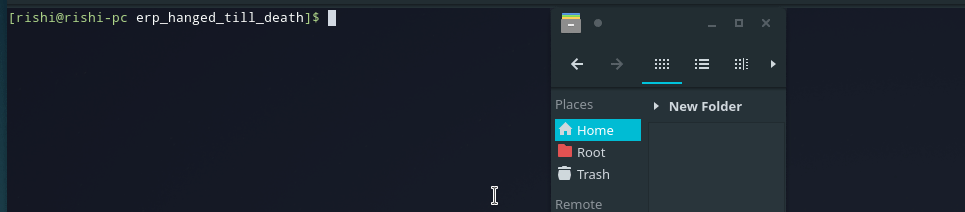

# ERP Hanged till Death
## A new and better online version is available on https://github.com/RishiRaj22/erp_web
Tired of pressing hundreds of buttons like a baboon just for accessing your attendance. Just use this script to make life a bit less painful.

Here is how it works


## Installation
* Download and setup chrome driver by going to http://chromedriver.chromium.org/getting-started
* Download and setup python and pip

```
sudo pip install selenium
git clone https://github.com/RishiRaj22/erp_hanged_till_death.git
```

## Run
```
python attendance.py <user_id> <password>
```

## Like it?

If you love it, spread the word in your groups, and don't forget to star the repo
